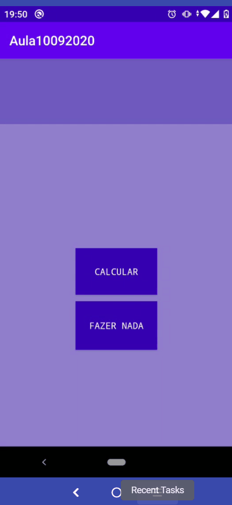

# Localidade dos arquivos da aula:


```bash
- app/src/main/res/layout/activity_main.xml
- app/src/main/res/layout/tela2.xml
- app/src/main/java/com/example/nome-do-seu-projeto/MainActivity.java
```

## Demonstração

- [Play Store: Download App TemQueTerASacada](https://play.google.com/store/apps/details?id=com.dissotti.temqueterasacada&hl=pt_BR)

<h1 align="center">
    
</h1>

